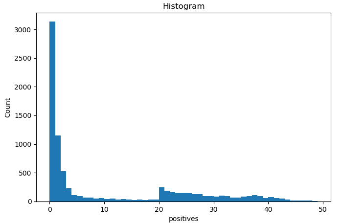
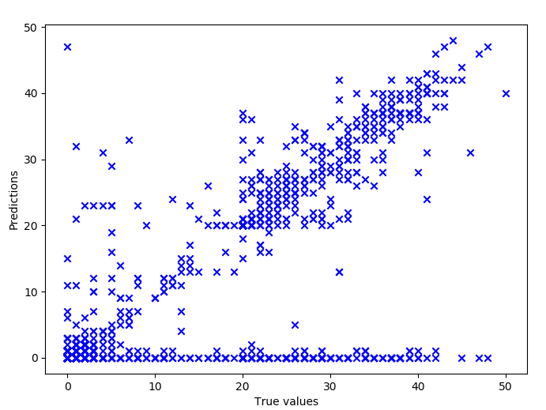

# Machine learning based Android OS malware classification

## Introduction

In this project work we will implement a machine learning model to categorize Android OS applications and analyze what features of the application could contribute the application to be classified as malicious. The categorization is based on positive votes given by VirusTotal. VirusTotal is an online service where you can upload file samples that will be analysed by multiple antivirus engines. The result of the analysis contains information about the positive votes, i.e. if the sample is judged as malicious (positive) or non-malicious (negative) and additional static and dynamic analysis information that is utilized as features in this work.

Below is a brief description of Android OS spesific terminology used in the report:
* Activity is an app component that presents a single screen in an app.
* Service is an app component that does only background processing.
* Broadcast receiver is an app component that handles broadcast intents.
* Intent is a messaging object used to request an action from an app component. Implicit intent does not spesify the receiver app component.
* Permission is an access control mechanism to limit the action the application is able to do within the OS.
* Signing certificate is used to sign the APK file and the certificate may be self-signed.

## Preprocessing of dataset used for training the machine learning model

The dataset used for machine learning model training is based on VirusTotal static and dynamic analysis information. The criteria for selecting the samples to the dataset is as follows

1. Samples marked as APK files (APK is the fileformat for Android applications) AND
2. Latest analysed samples (samples obtained 9/2018) AND
3. The sample has dynamic analysis information available AND
4. One of the following filters based on the number of positive votes given for each sample:
    * 40 or more
    * 20-39
    * 1-19
    * 0

Number of positive votes is used to categorize the samples. Sample file hash is used as index in the dataset.

The features selected from the dataset is presented in the following table.

Feature | Analysis type | Description
--- | --- | ---
File types | Static | Number of each file type within the APK file (e.g. dex, png, elf)
Intent filter for services/activities/broadcast receivers | Static | Specifies the types of implicit intents the service/activity/broadcast receivers advertise to receive
Permissions | Static | Number of requested permission for each category (e.g. normal, dangerous, sms) and name of the requested permission
Accessed/opened files | Dynamic | The files that the app accesses/opens
Dynamically called methods | Dynamic | The methods that the app calls
Dynamic broadcast receivers | Dynamic | Intent filter for dynamically started broadcast receivers
External programs | Dynamic | External programs called
Signing certificate common name | Static | Common name in the certificate used to sign the APK file
F-PROT unpacker | Static | Additional information provided by F-PROT antivirus (presumably related to file packing)

The script for extracting the features from a VirusTotal scan report is presented in [here](src/write_scan_report_to_csv.py) and sample (anonymized) report in [here](src/1172de52be1036c9b51e3f3c38a30a5bd8110bff4e31d1af36f54c822885012b)

The dataset consist of 8,5k samples and 50k features. Because of the constrains of this project, the number of features had to be reduced to speed up the analysis and model development. The reduction was achieved by removing unique features (i.e. only one sample contained a removed feature), resulting to 13k features.

The number of positive votes in the dataset is as follows

It seems that the search function that is used to search for samples favours samples that have the highest number of positive votes within the limits of the selection criteria. 

## Machine learning model

Some machine learning models were experimented such as Support Vector Machines and K Nearest Neighbor classifier. The selected machine learning model is an Extra-tree classifier. The model is driven with default Skikit-learn parameters and the implementation is presented in [here](src/extra_tree_classifier_feature_importance.py). Skikit-learn defines the selected classifier as follows:

"This class implements a meta estimator that fits a number of randomized decision trees (a.k.a. extra-trees) on various sub-samples of the dataset and uses averaging to improve the predictive accuracy and control over-fitting."

The dataset is split randomly to training and validation sets with split of 80/20, respectively.

Final step for preprocessing the dataset would be to determine the categories used as the ground truth. A one approach would be to treat the number of positive votes as categories as such. Such categorization leads to following result:

It seems that the classifier is able to make some predictions pretty close to the ground truth but only about half of the predictions are exactly correct. In addition, some samples, almost in all categories, are hugely misclassified to zero positive category. This can be explained by the skewed dataset where zero positives are the dominating category. To overcome these problems two other categorizations are experimented. The first one has binary classification: 0 vs 1 or more (1+) positive votes. The second one has four categories: 0 vs 1-19 vs 20-39 vs 40 or more (40+) positive votes. 

The binary classifier makes correct prediction 85% of the time with following confusion matrix:

Truth\prediction | 0 | 1+
--- | --- | ---
0 | 510 | 132
1+ | 129 | 921

The four category classifier makes correct predictions 78% of the time with following confusion matrix:

Truth\prediction | 0 | 1 to 19 | 20 to 39 | 40+
--- | --- | --- | --- | ---
0 | 572 | 74 | 20 |  0 
1-19 | 138 | 320 | 44 | 0  
20-39 | 26 | 31 | 393 | 14   
40+ | 4 | 1 | 18 | 37

## Feature analysis

Feature importances are analysed in order to find out which features of the application could contribute the application to be classified as malicious. The following table lists the most important features of the binary classifier model.

Category | Feature | Importance | Conclusions
--- | --- | --- | ---
File types | PNG |  0.027352 | The mean number of PNG files is 340 in category 0 and 220 in category 1. The malicious apps are simpler in this sense but there seems to be no clear security implications. 
Signing certificate common name | Android | 0.024004 | Category 0 has this feature in 3% of samples and category 1 in 18% of samples. The reasons for the malicious app to contain this CN so often could be that the author didn't bother to invent a fake name or he wanted to spesifically to give a common name so that he could not be identified (ironically). 
File types | XML | 0.023143 | The mean number of XML files is 117 in category 0 and 91 in category 1. The malicious apps are simpler in this sense but there seems to be no clear security implications.
Permissions | android.permission.READ_PHONE_STATE | 0.022913 | Category 0 has this feature in 40% of samples and category 1 in 74% of samples. According the Android documentation: "Allows read only access to phone state, including the phone number of the device, current cellular network information, the status of any ongoing calls, and a list of any PhoneAccounts registered on the device." Therefore, it is a dangerous permission that provides valuable information to the malicious application.
File types | Unknown | 0.016713 | The mean number of unknown files is 50 in category 0 and 38 in category 1. One would expect that non-malicious samples would contain less unknown files since they are supposed to do well known actions. Therefore, it seems that VirusTotal file types classification does not identify some common Android spesific file types.
File types | JPG | 0.013286 | The mean number of JPG files is 10 in category 0 and 9 in category 1. The malicious apps are simpler in this sense but there seems to be no clear security implications.
Permissions | android.permission.ACCESS_WIFI_STATE | 0.012983 | Category 0 has this feature in 42% of samples and category 1 in 67% of samples. This should not be a dangerous permission since it allows only to get information about the WiFi networks. However, the SSID information could be valuable to attacker to identify the device location or organization that the device is operated in.
Permissions | com.google.android.c2dm.permission.RECEIVE | 0.010864 | Category 0 has this feature in 26% of samples and category 1 in 10% of samples. This is the permission required to use Google Cloud Messaging client application. Seems that non-malicious apps implement push messaging more often that malicious applications.
Permissions | android.permission.GET_TASKS | 0.010633 | Category 0 has this feature in 15% of samples and category 1 in 41% of samples. This permission enables getting information about running task that are a collection of activities that users interact with. It would provide sensitive information to the attacker.
Permissions | Normal | 0.010553 | Mean number of permissions in normal permission group is 3 in category 0 and 4 in category 1. The permission that belong to the normal permission group don't pose much risk to the user's privacy or the device's operation and are granted automatically by the OS. It seems that malicious apps tend to need more permissions in general.
Permissions | Privacy | 0.009435 | Mean number of permissions in normal permission group is 2 in category 0 and 3 in category 1. The permissions that belong to the privacy permission group pose risks to user's privacy. It is not surprise that malicious apps would favour these permissions.
... | ... | ... | ...
Dynamic broadcast receivers | None | 0.008078 | Category 0 has this feature in 44% of samples and category 1 in 39% of samples. The malicious apps use more probably dynamic broadcast receivers. This would be easy way to obfuscate potentially malicious activities from simple static analysis that is based on reading the app manifest.
... | ... | ... | ... 
Intent filter for receivers | android.intent.action.PACKAGE_ADDED | 0.007080 | Category 0 has this feature in 7% of samples and category 1 in 24% of samples. This intent is sent when an app is installed on device and the name of the app is provided. Clearly, this is something that malicious apps are interested in.
... | ... | ... | ... 
Opened files | /mnt/sdcard | 0.006816 | Category 0 has this feature in 30% of samples and category 1 in 40% of samples. Prior to Android 4.4. the apps could access any files in the SD card if they have permission to access the SD card. This would provide access to other apps data if they are using the SD card and this would be an easy way access confidential information.
... | ... | ... | ... 

The feature importance contains one very surprising result. Access to file /system/bin/su is 3174th important feature in the binary classifier case. 2% of samples in category 0 has this feature and 5 % of samples in  category 1. Since the su binary could allow root privileges to the app, it is surprising that so few malicious apps attempt to access it. On the other hand there should be no reason for non-malicious apps to access it but only in root detection purposes in order prevent app from running in rooted devices that enable easier exploitation of the app.

## Conclusions

The created machine learning model is able to make categorization with 85% accuracy. This is considered a decent result given that only few machine learning models were experimented and no model nor dataset optimizations were done. In addition, the ground truths within the dataset contains errors because the antivirus engines that create the positive votes produce also false positives and false negatives.

The feature importance analysis shows that there is no obvious telltale sign that would help in identifying a malicious application. Common name 'Android' in the application signing certificate and requested permission 'android.permission.READ_PHONE_STATE' are the strongest indicators of malicious application. It seems that the features that are more common in non-malicious application are as important than features that are more common in malicious applications. 

